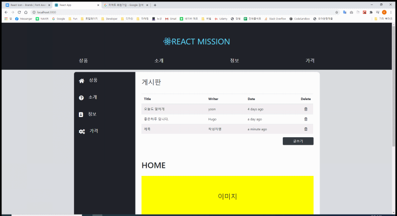

## 미션5

1. 1~4번 미션의 내용을 종합하여 메인화면 만들기 구현
2. 상단 GNB 메뉴 클릭시 좌측 트리메뉴 재세팅
3. 좌측 트리메뉴 마우스 오버시 하위메뉴 노출
4. 하위메뉴 클릭시 우측 컨텐츠 내용 바뀜
5. 컨텐츠 구현시 게시판 구현할 것
6. 게시판 구성 요소 : 리스트, 글등록, 글삭제, 글상세보기 팝업

.

### Checkbox state 관리

-   love, game, movie 3가지 중복선택도 가능한 경우
-   객체에 담아서 각각 true, false를 나타내준다.
-   { love: true, game: false, movie: true }
-   input 태그에 따로 value 값을 줄필요 없이 checked 여부만 주면된다.

### Ratio State 관리

-   중복 선택되면 안되므로 input 태그의 name 값을 동일하게 주고
-   value 값을 따로 주고 state에는 value 값을 저장한다.
-   state에 저장된 value값과 input 태그의 value가 일치하는 값만 true로 나타냄
