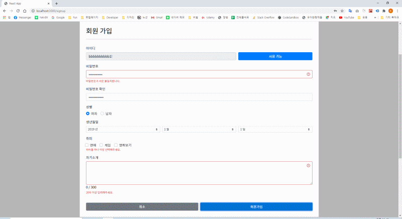

## ※ Personer Project [Front-End + Back-End]

### DESCRIPTION

Personal project (React + NodeJs)



### PROCEDURE:

```
$ git clone https://github.com/kyungyoonha/react_mission.git
$ git install
$ cd react_mission
$ npm start
$ mongo // => need to start mongo server

$ npm run client // => run client only
$ npm run server // => run server only

```

### 구현 기능

#### Common

- Signup & Login
- Social login (facebook)
- Regular expression Validation
- Access Token, Refresh Token

#### Front-End

- Custom CSS for styling
- API (Movie list)
- LNB & GNB 3 depth MENU
- Board CRUD
- Slider & Carousel
- Responsive Page for desktop and tablet

#### Back-End

- NodeJS
- Bcrypt
- JWT
- Facebook Social Login
- pagination
- MongoDB

#### Next Step

- styled-components
- fullpage scroll
- MySQL
