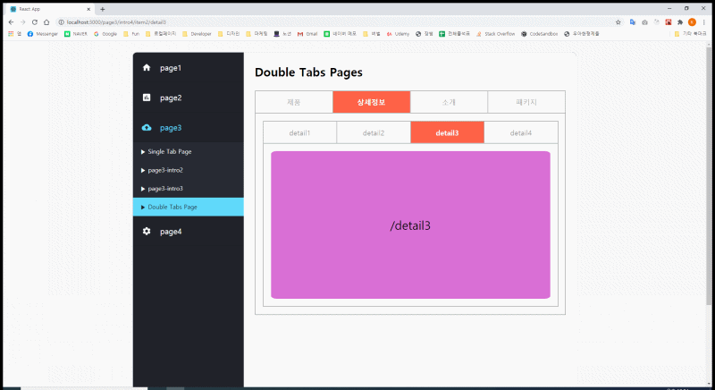

## 미션4

1. 3단계 미션에 이어서 3번메뉴의 서브메뉴 1의 경우 탭메뉴 화면이 등장.
2. 탭메뉴는 클릭시 해당 탭이 활성화되고, 하단에 컨텐츠노출
3. 다른 탭을 누를시 이전 탭이 비활성화, 클릭된 탭이 활성화되고, 하단 컨텐츠가 클릭된 탭의내용으로 바뀜
4. 1차 탭메뉴를 완성했다면, 2중 탭메뉴 구현
5. 2중 탭메뉴란, 탭 메뉴 안에 2차 탭메뉴가 있는형태
6. 3번메뉴의 서브메뉴4번을 누를시 2차 탭메뉴 컨텐츠 노출
7. 부모탭메뉴 1~4 번 누를시 컨텐츠에 2차 탭메뉴 노출.
8. 각 2차 탭메뉴 클릭시 하단에 컨텐츠가 바뀜

.

## 미션3

1. 좌측 메뉴는 트리구조로 펼쳐져야 한다.
2. 메뉴데이터를 배열 또는 객체데이터로 설정하여
3. 메뉴 컴포넌트에 할당하여 부모메뉴와 서브메뉴로 노출
4. 부모메뉴를 마우스 오버하면 하위 서브 메뉴가 슬라이딩
5. 하위 메뉴 클릭시 우측 컨텐츠 영역에 컨텐츠 노출
6. 하위 메뉴 클릭시마다 컨텐츠 내용은 바뀌어야 함.

.
